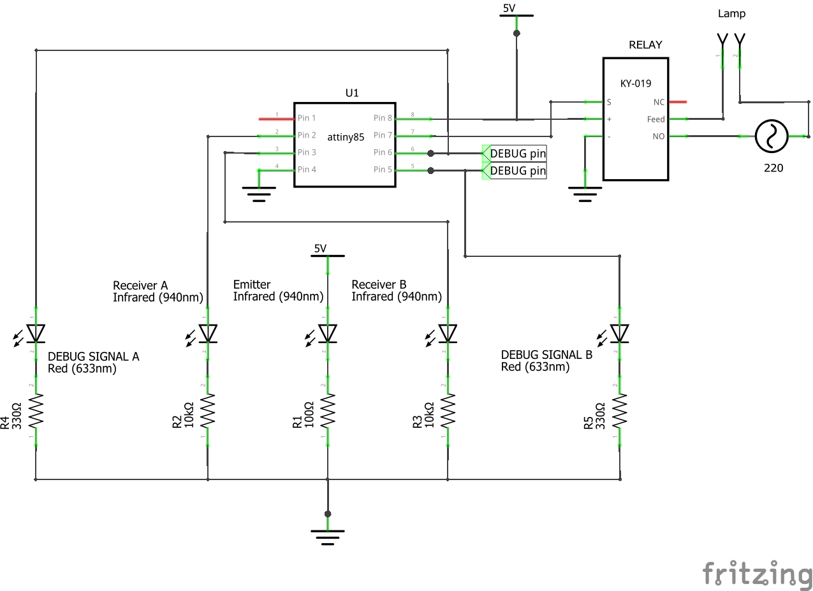
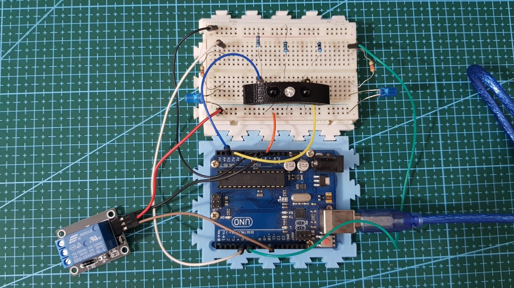
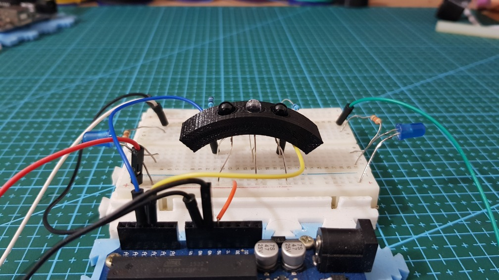

# Directional Presence

> This is a work in progress

* Detects the presence and direction of an object using cheap Infrared radiation (IR) sensors.  
* Turns ON a Relay by counting if there are objects present in one side of the sensor

The idea behind this devise is to mount it in a doorway and then turn on/off the main light only when there are people inside. It works by counting how many persons are entering are leaving the room.

It's thought to use an ATTiny85 although it has an optional debugger by using leds and a serial monitor with (i.e.) an Arduino Uno.

